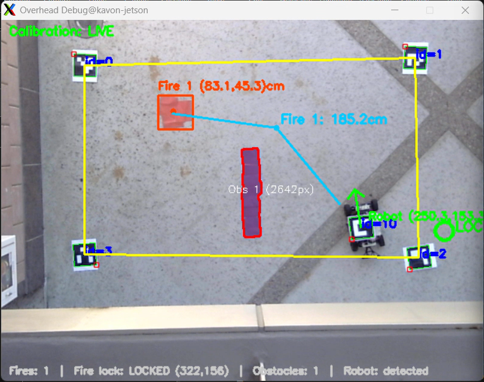
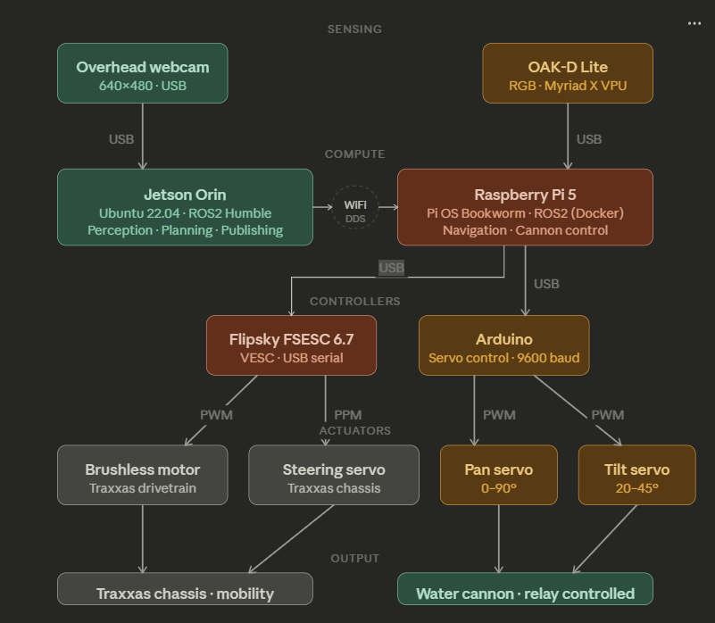

# ecemae148-wi26-team4-firesight

### Team:
  - Kavon Naziri - ECE
  - Brandon Cervantes - ECE
  - Teren Li - MAE
  - Haven Cocos - MAE

## Overview:
FireSight is an end-to-end autonomous fire suppression system which uses the novel overhead companion system for proactive, real time pathfinding and navigation.

  

## System Architecture:

  

## Key Features:
  - Overhead Node:
    - Aruco marker detection for homography calibration
    - HSV color filter for fire and obstacle detection
    - A* path finding algorithm for navigation
  - Autonomous Navigation:
    - PID based waypoint navigation

## Challenges:
  - Ovehread Node:
    - Camera had narrow FOV, very sensitive to light, and low quality at distance
    - Running A* for every frame became computationally intensive leading to some lag
  - Autonomous Navigation:
    - Inconsistencies with custom VESC software
    - Continuously updating waypoints made navigation hard
    - Inconsistent inputs from overhead node

